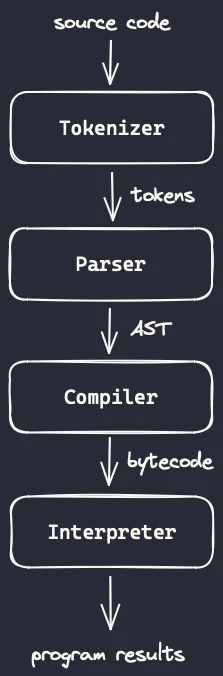
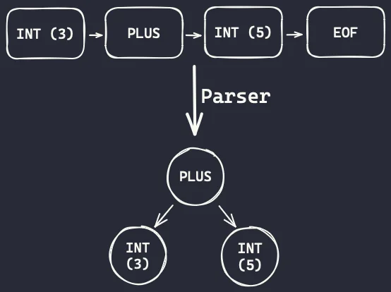
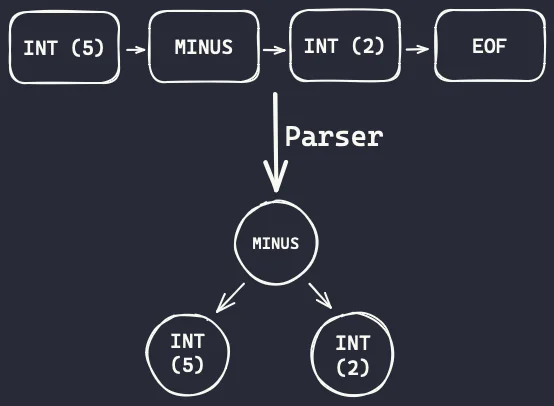

# 构建一个 Python 编译器和解释器（1）

> 原文链接：<https://mathspp.com/blog/building-a-python-compiler-and-interpreter>
>
> 翻译这一系列文章是因为几年前译者曾经使用 C++ 完成了一个可以支持精简 Java 语法的编译器及解释器项目用来学习先编译后解释的过程。然而尽管项目已经完成，译者一直未能对这个项目的学习过程进行总结归纳。如今译者看到这些文章的内容与我之前完成的项目非常相似，因此尝试翻译这些文章既作为复习，也当作当年项目的归纳整理。

在本系列教程中，我们将从头开始构建 Python 编译器和解释器。我们会从简单的算术表达式开始。

## 构建一个 Python 编译器和解释器

在这一系列文章中，我们将使用 Python 从头开始实现 Python 编程语言。

这个系列文章的最终目标是探索和尝试实现 Python 这样的编程语言所需的概念和算法。为此，我们将创建一种具有 Python 部分语法特性的编程语言，并在此过程中使用分词器（tokenizer）、解析器（parser）、编译器（compiler）和解释器（interpreter）！

需要声明的一点是：我在这个系列中的角色是带领你与我一起进行这个探索之旅，深入了解编程语言的工作原理。这对我们二人来说都是一个学习新知识的机会。

## 设置

> 这个系列将使用 Python 3.12 编写。如果你使用的是较旧的 Python 版本，你仍然应该能够跟上，因为我不会使用很多最近的特性。

> 译者使用 Python 3.11.2。

这个项目的设置非常简单。 我们可以从创建并激活虚拟环境开始：

``` Python
❯ python -m venv .venv
❯ . .venv/bin/activate
```

然后，我们可以创建一个 `requirements.txt` 文件，其中包含以下要求：

``` txt
mypy
black
pytest
```

我们可以通过以下方式安装需求

``` Python
❯ python -m pip install -r requirements.txt
```

使用以下命令确保所有内容均已正确安装：

``` Python
❯ mypy --version
mypy 1.6.1 (compiled: yes)

❯ black --version
black, 23.10.1 (compiled: no)
Python (CPython) 3.12.0

❯ pytest --version
pytest 7.4.2
```

> 译者更倾向于在虚拟环境下使用 `pip` 安装每个程序，然后使用命令 `pip freeze > requirements.txt` 导出依赖，或使用 Poetry、PDM 来管理依赖。

## 程序结构

### Python 是编译型还是解释型的？

Python 语言有一个编译步骤和一个解释步骤，我们将在我们的 Python 副本中模拟这两个步骤。如果你在 Python 代码旁边看到过一个文件夹 `__pycache__`，那就是包含编译后的 Python 代码的文件夹。然而，Python 代码并不会被编译成机器码，而是编译成字节码。

### Python 字节码和模块 `dis`

Python 字节码是 Python 代码编译成的一组简单指令。然后会有一个程序按顺序读取这些字节码指令并进行解释，这就是为什么我们常说 Python 是一种解释型语言。

在探索过程中，我们会经常使用模块 `dis`。模块 `dis` 代表反汇编，它可以让我们窥视许多 Python 对象背后的字节码。

例如，你可以做的最简单的事情之一就是向 `dis.dis` 传递一个函数并查看结果：

``` Python
>>> import dis

>>> def f(a, b):
...     return a + b
...

>>> dis.dis(f)
  1           0 RESUME                   0

  2           2 LOAD_FAST                0 (a)
              4 LOAD_FAST                1 (b)
              6 BINARY_OP                0 (+)
             10 RETURN_VALUE
```

你现在不需要了解所有的输出结果。相反，请看带有 `RESUME`、`LOAD_FAST`、`BINARY_OP` 和 `RETURN_VALUE` 字样的中间列。这些字节码指令组成了我们的函数 `f`。例如，你能猜出 `RETURN_VALUE` 指令的作用吗？

因此，了解字节码和使用模块 `dis` 将是我们项目的关键，但是使用字节码只是我们工作的一部分。

## 我们的程序的四个部分

值得庆幸的是，我们的程序具有由四个部分组成的线性结构。我们稍后将详细介绍每一部分，但我希望你们对接下来的内容有一个大致的了解。



我们可以看到，这四个部分依次相互衔接：

- 分词器（tokenizer）将源代码作为输入并生成标记（token）；
- 解析器（parser）将标记（token）作为输入并生成抽象语法树（AST）；
- 编译器（compiler）将一个抽象语法树（AST）作为输入并生成字节码（bytecode）；并且
- 解释器（interpreter）将字节码（bytecode）作为输入并产生程序结果。

为了不让你们完全被蒙在鼓里，让我简单地告诉你们上面四句话的意思。

分词器（tokenizer）将源代码分割成标记（token），标记是源代码中可以单独识别的小片段。例如，数字、数学运算符、变量名和关键字（如 `if` 或 `for`）都是标记。

> 译者：有时候会用词法分析器（lexer）来称呼分词器（tokenizer）。

解析器（parser）会将标记的线性序列重塑为树状结构（这就是 AST 中的 T 所代表的含义：树）。这棵树赋予了你的标记的意义，并提供了一种更易于推理和工作的良好结构。

一旦我们有了树状结构，我们的编译器（compiler）就可以遍历树并找出哪些字节码指令代表树中的代码。例如，如果树的一部分表示函数，我们可能需要该函数的 `return` 语句的字节码。

最后，解释器（interpreter）接收这些字节码指令并执行它们，产生原始程序的结果。

我们的第一个原型将计算加法和减法。到本文结束时，您将拥有一个程序（包含分词器、解析器、编译器和解释器），可以计算诸如 `3 + 5`、`6 - 3` 和 `1 + 2 + 3 + 4 - 5 - 6 + 7 - 8` 等表达式的结果。

## 分词器

分词器是你程序的一部分，它接受源代码并生成一个线性的标记序列 —— 即你标识为相关的源代码位。

> 译者注：最后一句不知道该怎么翻译，英文原文为 ‘_bits of source code that you identify as being relevant._’

### 标记类型

由于我们要支持整数的加法和减法，因此需要三种类型的标记：

1. 表示整数的标记类型；
2. 用于 `+` 操作符的标记类型；以及
3. 用于 `-` 操作符的标记类型。

我们还需要最后一个标记来表示程序的结束，我们称之为 EOF（End of File，代表文件结束）。我们将使用一个 `Token` 数据类来代表标记，这个类将有两个属性：

1. 标记类型（将是一个 `StrEnum` 类型）；以及
2. 标记的值（例如，整数标记的值可以是 `1` 或 `5`）。

> 译者注：`StrEnum` 为 Python 3.11 开始的新功能。

下面是设置此功能的代码：

``` Python
from dataclasses import dataclass
from enum import StrEnum, auto
from sys import version_info
from typing import Any


assert version_info.major == 3 and version_info.minor >= 11


class TokenType(StrEnum):
    INT = auto()
    PLUS = auto()
    MINUS = auto()
    EOF = auto()

@dataclass
class Token:
    type: TokenType
    value: Any = None
```

以防你不知道，[模块 `enum` 中的 `StrEnum` 类](https://docs.python.org/zh-cn/3/library/enum.html#enum.StrEnum) 创建了一个枚举，其中的值可以作为字符串使用，函数 `auto()` 自动创建枚举的值，这样我就不必自己编写所有内容了：

``` Python
class TokenType(StrEnum):
    INT = "int"
    PLUS = "plus"
    MINUS = "minus"
    EOF = "eof"
```

> 译者注：Python Docs 中注明了将 `auto` 用于 `StrEnum` 会得到小写形式的成员名称字符串值，但是作者原文中却使用了大写形式，因此在这里做了修正。

### 制造标记

现在，我们已经定义了我们的 `Token` 类，我们希望能够将一个字符串如

- `"3 + 5"` 转变为流 `[Token(INT, 3), Token(PLUS), Token(INT, 5), Token(EOF)]`；
- `"6 - 3"` 转变为流 `[Token(INT, 6), Token(MINUS), Token(INT, 3), Token(EOF)]`；以及
- `"1 + 2 + 3 + 4 - 5 - 6 + 7 - 8"` 转变为流 `[Token(INT, 1), Token(PLUS), Token(INT, 2), Token(PLUS), Token(INT, 3), Token(PLUS), Token(INT, 4), Token(MINUS), Token(INT, 5), Token(MINUS), Token(INT, 6), Token(PLUS), Token(INT, 7), Token(MINUS), Token(INT, 8), Token(EOF)]`。

为了能够创建这样的流，我们将创建一个接受代码字符串的 `Tokenizer` 类：

``` Python
class Tokenizer:
    def __init__(self, code: str) -> None:
        self.code: str = code
        self.ptr: int = 0
```

属性 `ptr` 将用于跟踪我们在源代码中所处的位置。现在，要实现 `next_token` 方法，我们需要做的就是将 `ptr` 滚过空白，然后确定我们指向的是加号 `+`、减号 `-` 还是数字：

``` Python
from string import digits

class Tokenizer:
    # ...

    def next_token(self) -> Token:
        while self.ptr < len(self.code) and self.code[self.ptr] == " ":
            self.ptr += 1

        if self.ptr == len(self.code):
            return Token(TokenType.EOF)

        char = self.code[self.ptr]
        self.ptr += 1
        if char == "+":
            return Token(TokenType.PLUS)
        if char == "-":
            return Token(TokenType.MINUS)
        if char in digits:
            return Token(TokenType.INT, int(char))
        raise RuntimeError(f"Can't tokenize {char!r}.")
```

这样就足以对上述表达式进行标记化！

只需几行额外的代码，就可以将一个表达式字符串转换成标记：

``` Python
if __name__ == "__main__":
    CODE = "1 + 2 + 3 + 4 - 5 - 6 + 7 - 8"
    tokenizer = Tokenizer(CODE)
    print(CODE)
    while (tok := tokenizer.next_token()).type != TokenType.EOF:
        print(f"\t{tok.type}, {tok.value}")

"""
1 + 2 + 3 + 4 - 5 - 6 + 7 - 8
        int, 1
        plus, None
        int, 2
        plus, None
        int, 3
        plus, None
        int, 4
        minus, None
        # ...
"""
```

> 译者注：`:=`（海象运算符）为 Python 3.8 引入的[新赋值表达式](https://docs.python.org/zh-cn/3/whatsnew/3.8.html#assignment-expressions)

分词器的代码还应该强调一个关键方面：分词器并不关心你的代码是否正确！它同样能处理代码字符串 `"3 + 5"` 或 `"3 3 3 + 5 5 - - -"`：

``` Python
if __name__ == "__main__":
    CODE = "3 3 3 + 5 5 5 - - -"
    tokenizer = Tokenizer(CODE)
    print(CODE)
    while (tok := tokenizer.next_token()).type != TokenType.EOF:
        print(f"\t{tok.type}, {tok.value}")

"""
3 3 3 + 5 5 5 - - -
        int, 3
        int, 3
        int, 3
        plus, None
        int, 5
        int, 5
        int, 5
        minus, None
        minus, None
        minus, None
"""
```

这样做是没有关系的，解析器将负责确保代码的合理性。

### 让分词器成为一个可迭代对象

最后，为了方便起见，我会把 `Tokenizer` 类变成一个可迭代对象，这样我们就可以直接循环查看一段代码中的标记：

``` Python
class Tokenizer:
    # ...

    def __iter__(self) -> Generator[Token, None, None]:
        while (token := self.next_token()).type != TokenType.EOF:
            yield token
        yield token  # Yield the EOF token too.
```

有了这一改动，就可以用 `for` 循环来遍历源代码的标记：

``` Python
if __name__ == "__main__":
    CODE = "1 + 2 + 3 + 4 - 5 - 6 + 7 - 8"
    tokenizer = Tokenizer(CODE)
    print(CODE)
    for tok in tokenizer:
        print(f"\t{tok.type}, {tok.value}")
```

### 测试分词器

现在分词器的基本框架已经就绪，我们可以创建几个简短的测试来让我们相信代码在我们不断推进的过程中可以正常工作。

为此，我将创建一个 `tests` 文件夹，并在其中创建一个 `test_tokenizer.py` 文件。然后，我将编写一些测试：一些调用分词器的函数，然后检查结果是否与我手写的标记列表相匹配。下面是我写的第一个测试：

``` Python
from tokenizer import Token, Tokenizer, TokenType

def test_tokenizer_addition():
    tokens = list(Tokenizer("3 + 5"))
    assert tokens == [
        Token(TokenType.INT, 3),
        Token(TokenType.PLUS),
        Token(TokenType.INT, 5),
        Token(TokenType.EOF),
    ]

def test_tokenizer_subtraction():
    tokens = list(Tokenizer("3 - 6"))
    assert tokens == [
        Token(TokenType.INT, 3),
        Token(TokenType.MINUS),
        Token(TokenType.INT, 6),
        Token(TokenType.EOF),
    ]

def test_tokenizer_additions_and_subtractions():
    tokens = list(Tokenizer("1 + 2 + 3 + 4 - 5 - 6 + 7 - 8"))
    assert tokens == [
        Token(TokenType.INT, 1),
        Token(TokenType.PLUS),
        Token(TokenType.INT, 2),
        Token(TokenType.PLUS),
        Token(TokenType.INT, 3),
        Token(TokenType.PLUS),
        Token(TokenType.INT, 4),
        Token(TokenType.MINUS),
        Token(TokenType.INT, 5),
        Token(TokenType.MINUS),
        Token(TokenType.INT, 6),
        Token(TokenType.PLUS),
        Token(TokenType.INT, 7),
        Token(TokenType.MINUS),
        Token(TokenType.INT, 8),
        Token(TokenType.EOF),
    ]
```

现在，为了运行测试，你需要使用 `pytest`。`pytest` 是一个可以用于测试的 Python 框架，如果运行 `pytest .` 命令，它将查找名称以 `test_` 开头的文件夹/文件，然后尝试找到并运行同样以 `test_` 开头的函数。这就是为什么我创建了一个名为 `test_tokenizer.py` 的文件，也是为什么上面所有函数都以 `test_` 开头。

因此，运行命令 `pytest .` 运行测试！你应该会得到一个错误信息：

``` Bash
# ...
E   ModuleNotFoundError: No module named 'tokenizer'
========================= short test summary info ==========================
ERROR tests/test_tokenizer.py
!!!!!!!!!!!!!!!!!! Interrupted: 1 error during collection !!!!!!!!!!!!!!!!!!
============================= 1 error in 0.03s =============================
```

怎么了？问题在于我们还没有（在虚拟环境中）安装我们的项目，因此 Python 无法导入 `tokenizer`，因为它不知道在哪里可以找到它。我们可以（也许应该？）通过将我们的项目变成一个合适的软件包来解决这个问题，但我要向您展示一种简单易行的方法。

首先要做的是在文件夹中创建一个空文件 `pyproject.toml`。然后，运行命令 `pip install -e .` 。命令中的 `.` 将安装它在本地项目中找到的代码（此时只是文件 `tokenizer.py`），而 `-e` 参数说明这个安装是可编辑的，这意味着你可以编辑代码并且修改将反映在安装的版本中。

如果你按照上述两个步骤操作，现在应该可以运行 pytest 了：

``` Bash
❯ pytest .
============================================================================ test session starts ============================================================================
platform linux -- Python 3.11.2, pytest-7.4.3, pluggy-1.3.0
rootdir: /home/kasen/bpci
collected 3 items

test/test_tokenizer.py ...                                                                                                                                        [100%]

============================================================================= 3 passed in 0.01s =============================================================================
```

我们还将增加三个测试。其中一个测试是在解析的表达式中添加大量无关的空白，以确保分词器可以通过测试：

``` Python
def test_tokenizer_additions_and_subtractions_with_whitespace():
    tokens = list(Tokenizer("     1+       2   +3+4-5  -   6 + 7  - 8        "))
    assert tokens == [
        Token(TokenType.INT, 1),
        Token(TokenType.PLUS),
        Token(TokenType.INT, 2),
        Token(TokenType.PLUS),
        Token(TokenType.INT, 3),
        Token(TokenType.PLUS),
        Token(TokenType.INT, 4),
        Token(TokenType.MINUS),
        Token(TokenType.INT, 5),
        Token(TokenType.MINUS),
        Token(TokenType.INT, 6),
        Token(TokenType.PLUS),
        Token(TokenType.INT, 7),
        Token(TokenType.MINUS),
        Token(TokenType.INT, 8),
        Token(TokenType.EOF),
    ]
```

这与之前的测试相同，只是我修改了字符串内的空格。

我们要添加的第二个测试是，确保分词器在发现不知道如何标记的内容时会引发错误。对于这个测试，我们只需编写一些垃圾代码，然后使用 pytest 的一个工具让我们说 "嘿，我们希望这段代码会引发错误"。如果代码引发错误，测试就通过了。如果代码没有引发错误，则测试失败。下面是使用 pytest 的方法：

``` Python
import pytest

def test_tokenizer_raises_error_on_garbage():
    with pytest.raises(RuntimeError):
        list(Tokenizer("$"))
```

我们要添加的最后一项测试是确保分词器能分别识别每种标记类型。分词器并不关心代码的结构，因为它不知道如何区分垃圾代码和有意义的代码，这意味着我们可以只用表示运算符或整数的字符串进行测试，分词器仍然知道如何标记这些字符串。

因此，这些测试是完全有效的：

``` Python
def test_tokenizer_knows_plus():
    tokens = list(Tokenizer("+"))
    assert tokens == [Token(TokenType.PLUS), Token(TokenType.EOF)]

def test_tokenizer_knows_minus():
    tokens = list(Tokenizer("-"))
    assert tokens == [Token(TokenType.MINUS), Token(TokenType.EOF)]

def test_tokenizer_knows_integer():
    tokens = list(Tokenizer("3"))
    assert tokens == [Token(TokenType.INT, 3), Token(TokenType.EOF)]
```

这些测试很有帮助，因为它们将确保我们的分词器始终能够识别它应该识别的标记。然而，我们的分词器还将会增长，我们希望为我们知道的所有标记添加测试，因此我们将使用另一个 pytest 工具来简化这些测试的编写。

我们首先要注意到上述三个测试看起来非常相似，唯一变化的是进入分词器的代码片段和 EOF 标记前的第一个标记。因此，我们可以重写这些测试：

``` Python
def tokenizer_recognises_each_token(code: str, token: Token):
    tokens = list(Tokenizer(code))
    assert tokens == [token, Token(TokenType.EOF)]

def test_tokenizer_knows_plus():
    tokenizer_recognises_each_token("+", Token(TokenType.PLUS))

def test_tokenizer_knows_minus():
    tokenizer_recognises_each_token("-", Token(TokenType.MINUS))

def test_tokenizer_knows_integer():
    tokenizer_recognises_each_token("3", Token(TokenType.INT, 3))
```

pytest 提供了一个名为`pytest.mark.parametrize` 的工具可以让我们以更方便的方式将其编写为 `tokenizer_recognises_each_token` 函数的装饰器，现在必须以 `test_` 开头，因为它成为了一个测试函数：

``` Python
@pytest.mark.parametrize(
    ["code", "token"],
    [
        ("+", Token(TokenType.PLUS)),
        ("-", Token(TokenType.MINUS)),
        ("3", Token(TokenType.INT, 3)),
    ],
)
def test_tokenizer_recognises_each_token(code: str, token: Token):
    tokens = list(Tokenizer(code))
    assert tokens == [token, Token(TokenType.EOF)]
```

现在运行测试应该会获得 8 次成功：

``` Bash
❯ pytest .
=============================================================== test session starts ===============================================================
platform linux -- Python 3.11.2, pytest-7.4.3, pluggy-1.3.0
rootdir: /home/kasen/bpci
collected 8 items

test/test_tokenizer.py ........                                                                                                             [100%]

================================================================ 8 passed in 0.01s ================================================================
```

## 解析器

解析器是我们程序中的一部分，它接受标记流并确保它们是有意义的。

例如，在上一节中，我们看到分词器能接收代码字符串 `3 + 5` 和 `3 3 3 + 5 5 - - -`，但解析器却不是这样。解析器会查看 `3 + 5` 的标记并识别为两个整数的加法，但如果收到所谓 "代码" `3 3 3 + 5 5 - - -` 的标记流，解析器就会抱怨。

### 解析器创建一颗树

不过，解析器的作用远不止于此。解析器不仅要确保标记序列是有意义的，还要使用标记以树形构建代码的另一种表示形式。

下图显示了几个示例。

如果我们将代码 `3 + 5` 传递给分词器，就会得到这样的标记流：

``` Python
Token(type=<TokenType.INT: 'int'>, value=3)
Token(type=<TokenType.PLUS: 'plus'>, value=None)
Token(type=<TokenType.INT: 'int'>, value=5)
Token(type=<TokenType.EOF: 'eof'>, value=None)
```

解析器将使用这些标记创建一棵有三个节点的简单树，其中加号节点连接另外两个整数节点：



注意根节点是加法。这是因为加法是一个运算，而整数 3 和 5 只是加法的操作数。这就是为什么节点 3 和 5 位于加法节点之下。

你认为从代码 `5 - 2` 中得到的树是什么？请在纸上勾画出来，然后继续阅读。

如果我们将代码 `5 - 2` 传递给标记符生成器，就会得到这样的标记流：

``` Python
Token(type=<TokenType.INT: 'int'>, value=5)
Token(type=<TokenType.PLUS: 'minus'>, value=None)
Token(type=<TokenType.INT: 'int'>, value=2)
Token(type=<TokenType.EOF: 'eof'>, value=None)
```

解析器将使用这些标记创建一棵有三个节点的简单树，其中减法连接另外两个整数节点：



请再次注意，操作（减法）是根节点。运算将其操作数作为子节点。

表示减法的节点有两个子节点，因为减法需要两个数字才能运算。

### 抽象语法树

我们建立的这棵树被称为抽象语法树（AST）。说它是抽象语法树，是因为它是一种树形表示法，并不关心我们编写操作时使用的原始语法。它只关心我们将要执行的操作。

例如，我们可以决定我们的语言将使用前缀表示法，因此加法现在将表示为 `+ a b`，减法将表示为 `- a b`。

现在，分词器将以不同的顺序生成标记，但解析器仍将构建相同的树。为什么？因为解析器只关心代码做了什么，而不关心代码是如何编写的。

### 树节点

我们已经看到我们将使用树来表示代码。 那么，我们需要的是这些节点的类！如下所示：

``` Python
from dataclasses import dataclass

@dataclass
class TreeNode:
    # pass
```

在这个系列中，我们将为每种类型的节点创建 `TreeNode` 的子类。现在，我们将为二进制运算（加法和减法）和整数创建节点类型：

``` Python
@dataclass
class BinOp(TreeNode):
    op: str
    left: "Int"
    right: "Int"

@dataclass
class Int(TreeNode):
    value: int
```

### 定义解析器

为了定义我们的解析器，我们将使用名为 `eat` 和 `peek` 的两个辅助方法：

``` Python
class Parser:
    def __init__(self, tokens: list[Token]) -> None:
        self.tokens: list[Token] = tokens
        self.next_token_index: int = 0
        """Points to the next token to be consumed."""

    def eat(self, expected_token_type: TokenType) -> Token:
        """Returns the next token if it is of the expected type.

        If the next token is not of the expected type, this raises an error.
        """
        next_token: Token = self.tokens[self.next_token_index]
        self.next_token_index += 1
        if next_token.type != expected_token_type:
            raise RuntimeError(f"Expected {expected_token_type}, ate {next_token!r}.")
        return next_token

    def peek(self, skip: int = 0) -> TokenType | None:
        """Checks the type of an upcoming token without consuming it."""
        peek_at: int = self.next_token_index + skip
        return self.tokens[peek_at].type if peek_at < len(self.tokens) else None
```

`eat` 方法接受一个标记类型作为参数，确保我们排好队的下一个标记是该类型，然后返回该标记。（最后，`eat` 方法将检查我们的代码是否合理）。

我们可以使用 `peek` 方法来窥视即将到来的标记类型，而无需消耗标记。这就好比我们展望未来，看看即将发生什么。

如果你看一下同时使用这两个方法的 `parse` 方法，就会对这两个方法有更多的了解：

``` Python
class Parser:
    # ...

    def parse(self) -> BinOp:
        """Parses the program."""
        left_op: Token = self.eat(TokenType.INT)

        if self.peek() == TokenType.PLUS:
            op = "+"
            self.eat(TokenType.PLUS)
        else:
            op = "-"
            self.eat(TokenType.MINUS)

        right_op: Token = self.eat(TokenType.INT)

        return BinOp(op, Int(left_op.value), Int(right_op.value))
```

让我们逐行分析。首先是方法的签名和注释：

``` Python
def parse(self) -> BinOp:
    """Parses the program."""
```

方法 `parse` 不需要任何参数，它会返回一个 `BinOp` 节点：我们要解析的加法或减法的节点。

下一行调用 `eat` 方法：

``` Python
left_op = self.eat(TokenType.INT)
```

如果我们要解析加法和减法，我们知道首先要看到的是一个整数。因此，我们调用标记类型为 `INT` 的方法 `eat`。如果第一个标记不是整数，解析器就会抱怨。

然后，我们需要弄清楚是加法还是减法。这时就需要使用 `peek` 方法了：

``` Python
if self.peek() == TokenType.PLUS:
    op = "+"
    self.eat(TokenType.PLUS)
else:
    op = "-"
    self.eat(TokenType.MINUS)
```

我们窥视下一个标记，因为我们不知道它是 `PLUS` 还是 `MINUS`。如果是 `PLUS`，我们就吃掉标记并设置 `op = "+"`。如果不是 `PLUS`，我们就认为它一定是 `MINUS` 并直接吃掉该标记。我们不需要窥视它是否是一个 `MINUS` 标记，因为如果它不是，那么 `eat` 方法就会向我们抱怨。

在吃掉操作符标记后，我们可以期待一个新的整数标记：

``` Python
right_op = self.eat(TokenType.INT)
```

最后，我们需要使用标记及其值来构建重要的树节点！`left_op` 和 `right_op` 标记的值必须用树节点 `Int` 包装，而运算符本身必须用 `BinOp` 节点包装：

``` Python
return BinOp(op, Int(left_op.value), Int(right_op.value))
```

### 运行解析器

现在，我们已经设置了简单的解析器，可以试着用几个代码示例来运行它：

``` Python
if __name__ == "__main__":
    from tokenizer import Tokenizer

    CODE = "3 + 5"
    parser = Parser(list(Tokenizer(CODE)))
    print(parser.parse())  # BinOp(op='+', left=Int(value=3), right=Int(value=5))
```

如果我们将代码改为类似 `+ 5` 的内容，解析器就会抱怨：

``` Bash
RuntimeError: Expected int, ate Token(type=<TokenType.PLUS: 'plus'>, value=None).
```

我们得到这条错误信息是因为我们原本期望会在变量 `left_op` 中吃到一个整数，结果却发现了加号。

如果将 `CODE` 改为 `3 3`，会出现什么错误？

如果你猜到解析器会抱怨说它想要减号，那你就猜对了：

``` Python
if __name__ == "__main__":
    from tokenizer import Tokenizer

    CODE = "3 3"
    parser = Parser(list(Tokenizer(CODE)))
    print(parser.parse())  # RuntimeError: Expected minus, ate Token(type=<TokenType.INT: 'int'>, value=3).
```

为什么解析器说它要的是减号，而不是加号或减号？因为，如果你还记得，在 `parse` 方法中，我们用 `peek` 来寻找一个加号。当我们没有找到它时，我们假设会得到一个负数，并试图吃掉它。当我们找到一个整数时，解析器发出了抱怨。

### 解析完整的程序

此时，解析器只解析一个加法或减法。不过，如果你给它更多的标记，解析器也不会抱怨：

``` Python
if __name__ == "__main__":
    from tokenizer import Tokenizer

    CODE = "3 + 5 - 2"
    parser = Parser(list(Tokenizer(CODE)))
    print(parser.parse())  # BinOp(op='+', left=Int(value=3), right=Int(value=5))
```

一般来说，在解析完一个完整的程序后，我们还要确保我们解析了整个程序。现在，我们将改变解析器，使其预期程序由单项加法或减法组成。但我们该怎么做呢？

解析加法或减法后，我们会吃掉 EOF 标记！下面是更新后的 `parse` 方法：

``` Python
class Parser:
    # ...

    def parse(self) -> BinOp:
        """Parses the program."""
        left_op = self.eat(TokenType.INT)

        if self.peek() == TokenType.PLUS:
            op = "+"
            self.eat(TokenType.PLUS)
        else:
            op = "-"
            self.eat(TokenType.MINUS)

        right_op = self.eat(TokenType.INT)

        self.eat(TokenType.EOF)

        return BinOp(op, Int(left_op.value), Int(right_op.value))
```

### 测试解析器

与标记符号生成器一样，我们要为解析器编写一些基本测试。下面是两个测试，一个用来测试加法，另一个用来测试减法：

``` Python
from parser import Parser, Int, BinOp
from tokenizer import Token, TokenType

def test_parsing_addition():
    tokens = [
        Token(TokenType.INT, 3),
        Token(TokenType.PLUS),
        Token(TokenType.INT, 5),
        Token(TokenType.EOF),
    ]
    tree = Parser(tokens).parse()
    assert tree == BinOp(
        "+",
        Int(3),
        Int(5),
    )

def test_parsing_subtraction():
    tokens = [
        Token(TokenType.INT, 5),
        Token(TokenType.MINUS),
        Token(TokenType.INT, 2),
        Token(TokenType.EOF),
    ]
    tree = Parser(tokens).parse()
    assert tree == BinOp(
        "-",
        Int(5),
        Int(2),
    )
```

现在，您可以使用 `pytest .` 重新运行测试了...不过它不起作用！

运行测试时，无法将解析器导入测试脚本：

``` Python
ModuleNotFoundError: No module named 'parser'
```

问题在于解析器尚未安装，因此您可以通过重新 `pip` 安装代码来解决这个问题：

``` Bash
❯ pip install -e .
```

但这也会出错！现在问题出在哪里？问题在于你的目录根目录中有两个文件（`tokenizer.py` 和 `parser.py`），而且你没有正确配置你的项目。

但是，这不是你的错。我只是没告诉你该怎么做！

### `src` 文件夹结构

最简单的方法是创建一个 `src/python` 文件夹，在其中存放所有源代码。目录结构应该是这样的：

``` Bash
- src
  |- python
     |- parser.py
     |- tokenizer.py
- tests
  |- test_parser.py
  |- test_tokenizer.py
...
```

当你这样做时，你还必须修正导入模块。~~在源代码中，您可以像这样使用相对导入：~~

> 译者注：如果使用相对导入，会出现错误 `ImportError: attempted relative import with no known parent package`

``` Python
# parser.py
from dataclasses import dataclass

# notice the dot here.
# from .tokenizer import Token, TokenType
from python.tokenizer import Token, TokenType

# ...
```

在测试中，您需要在导入前加上 `python.`，因为分词器和解析器都在该包中：

``` Python
# test_tokenizer.py
import pytest

from python.tokenizer import Token, Tokenizer, TokenType
```

完成上述操作后，就可以使用 `pip install -e .` 安装我们的 `python` 模块，然后测试就会运行：

``` Bash
❯ pytest .
=========================================================== test session starts ============================================================
platform linux -- Python 3.11.2, pytest-7.4.3, pluggy-1.3.0
rootdir: /home/kasen/bpci
collected 10 items

test/test_parser.py ..                                                                                                               [ 20%]
test/test_tokenizer.py ........                                                                                                      [100%]

============================================================ 10 passed in 0.01s ============================================================
```

但有一点要注意，运行文件 `tokenizer.py` 或 `parser.py` 时，应分别使用 `python -m python.tokenizer` 或 `python -m python.parser` 命令，而不是 `python tokenizer.py` 或 `python parser.py`。
