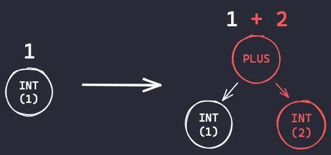
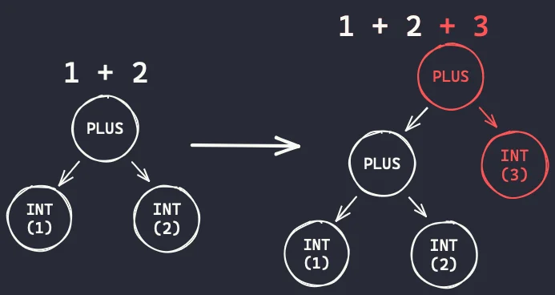
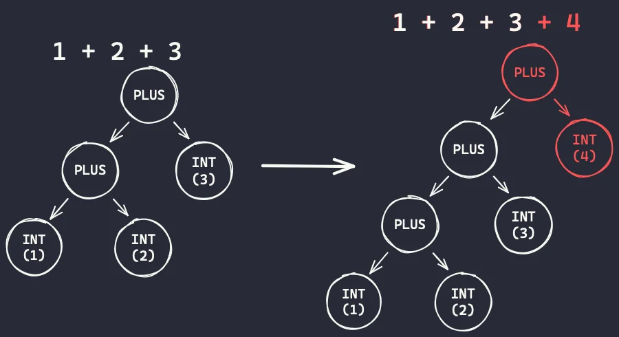

## 构建 Python 编译器和解释器

本文是 ["构建 Python 编译器和解释器"](https://mathspp.com/blog/tag:bpci) 系列的第三篇文章，因此在阅读本文之前，请确保您已经阅读了前两篇文章！

[GitHub 代码库中的 v0.2.0 标签代码](https://github.com/mathspp/building-a-python-compiler-and-interpreter/tree/v0.2.0)是作为本文起点的代码。

## 目标

本文的目标如下：

- 了解什么是语言语法，以及它将如何影响解析器的设计；
- 了解访问者模式，看看它使我们的编译器和解释器变得多么灵活；以及
- 增加对连续加减法的支持。

## 语言语法

语言语法是一种表示给定语言有效语法的方法。具体的符号略有不同，但要点始终是相同的。在语言语法中，你可以编写 "规则" 来表示在你的语言中有效的语法，每条规则包括两个部分：

1. 规则的名称；以及
2. 规则的 "主体"，表示与规则匹配的语法。

当然，规则之间可以相互参照，这就给语法（最终也给我们的编程语言）带来了自由度（但也带来了复杂性）。

### 我们语言的语法

现在，代表我们支持的 Python 子集的语法可以这样表示：

``` Python
program := computation EOF
computation := number (PLUS | MINUS) number
number := INT | FLOAT
```

我们用小写字母书写规则，用大写字母书写标记类型。因此，在上面的语法中，`program`、`computation` 和 `number` 指的是语法规则，而 `EOF`、`PLUS`、`MINUS`、`INT` 和 `FLOAT` 指的是标记类型。

`program` 规则如下

``` Python
program := computation EOF
```

这意味着一个 `program` 是一个 `computation`，然后后面跟着一个 `EOF` 标记。同时，`computation` 规则应为

``` Python
computation := number (PLUS | MINUS) number
```

这意味着 `computation` 是一个 `number`，然后后面跟一个 `PLUS` 或 `MINUS`，然后是另一个 `number`。请注意我们是如何使用符号 `|` 来表示其他选项的，因此 `PLUS | MINUS` 表示 "一个 `PLUS` 或一个 `MINUS`"。

最后，`number` 规则如下

``` Python
number := INT | FLOAT
```

这条规则意味着一个 `number` 要么是一个 `INT` 标记，要么是一个 `FLOAT` 标记。

### 语法与解析器之间的关系

再一次，下面这是完整的语法：

``` Python
program := computation EOF
computation := number (PLUS | MINUS) number
number := INT | FLOAT
```

现在，这是我们解析器的框架：

``` Python
class Parser:
    # ...

    def parse_number(self) -> Int | Float:
        """Parses an integer or a float."""
        ...

    def parse_computation(self) -> BinOp:
        """Parses a computation."""
        ...

    def parse(self) -> BinOp:
        """Parses the program."""
        ...
```

请注意我们如何为每个语法规则提供解析方法，并注意每个规则与解析方法的实现之间是如何对应的。你可以在下面找到三种解析方法以及该方法的 docstring 中对应的语法规则。

请留意每条规则中所写的内容与解析方法的实现。注意语法规则的主体是如何决定实现的。如果规则主体中引用了一条规则，我们就会调用其解析方法。如果规则主体中引用了标记类型，我们会调用 `eat` 方法来消耗该标记。

``` Python
class Parser:
    # ...

    def parse_number(self) -> Int | Float:
        """Parses an integer or a float.

        number := INT | FLOAT
        """
        if self.peek() == TokenType.INT:
            return Int(self.eat(TokenType.INT).value)
        else:
            return Float(self.eat(TokenType.FLOAT).value)

    def parse_computation(self) -> BinOp:
        """Parses a computation.

        computation := number (PLUS | MINUS) number
        """
        left = self.parse_number()

        if self.peek() == TokenType.PLUS:
            op = "+"
            self.eat(TokenType.PLUS)
        else:
            op = "-"
            self.eat(TokenType.MINUS)

        right = self.parse_number()

        return BinOp(op, left, right)

    def parse(self) -> BinOp:
        """Parses the program.

        program := computation EOF
        """
        computation = self.parse_computation()
        self.eat(TokenType.EOF)
        return computation
```

这应该会告诉你语言语法是多么有用。在本系列中，每当我们想要向语言中添加对任何东西的支持时，我们会修改语言语法，这将帮助我们理解如何修改解析器以适应这些更改。

我们很快就会看到这一点，因为我们将会改变语法来增加对连续加减法、一元运算符和括号表达式的支持。

现在，我们只需将完整语法写入解析器的 docstring：

``` Python
class Parser:
    """
    program := computation
    computation := number (PLUS | MINUS) number
    number := INT | FLOAT
    """

    # ...
```

### 语法决定一切

语法会主宰一切，虽然你还不知道，因为你还没读完这篇文章。解析器模仿语法，编译器和解释器将围绕解析器构建，因此语法是影响其他一切的唯一因素。

因此，从某种意义上说，了解如何修改语法来为语言添加新功能将是理解语言的关键所在。我们在语法上做得越多，你就会越能理解。现在，我将留给你们一些思考。

我们可以把前面的语法写成这样：

``` Python
program := computation EOF
computation := (INT | FLOAT) (PLUS | MINUS) (INT | FLOAT)
```

但我们没有这么做。我们创建了一条解析数字类型的规则。这将使得，例如，添加复数、分数或其他类型的数字变得更容易。

一般来说，我们会尽量保持语法规则的简洁，并且规则的层次结构会对操作的优先级产生影响。因此，在接下去的工作中，我们要牢记这一点。

例如，请注意 `EOF` 是如何在最上面的规则（规则 `program`）中被提及的，同时，在解析标记时，令牌 `EOF` 是最后一个被吃掉的。相反，`number` 规则位于规则嵌套的 "底部"，而数字是我们在程序中首先解析的内容。因此，语法中 "深处" 的规则对应于倾向被 "首先" 解析的内容，这意味着深度可以用来控制操作的优先级。

现在这可能有点抽象，但在本文末尾和接下来的几篇文章中会变得更清晰。

## 连续加法和减法

我们希望在编程语言中添加对连续加减法的支持。换句话说，我们希望能够支持如下程序：

- `1 + 2 + 3`
- `1 - 2 - 3`
- `5 - 3 + 4 + 11 - 7`

### 语法修改

为了做到这一点，我们需要改变我们的语法规则 `computation`，因为目前一个 `computation` 是单一的加法或减法。

因此，我们的 `computation` 规则目前看起来是这样的：

``` Python
computation := number (PLUS | MINUS) number
```

我们将对其进行修改，使其看起来像这样:

``` Python
computation := number ( (PLUS | MINUS) number )*
```

请注意，我们在规则的最后一部分添加了 `(...)*`。与正则表达式类似，符号 `*` 用于表示重复；特别是内容边上的 `*` 表示该内容可能出现 0 次或更多次。

因此，我们从 "`computation` 是一个数字，数字后面跟着一个加号或减号，加号或减号后面跟着一个数字" 变成了 "`computation` 是一个数字，数字后面是 0 次或多次重复的、后面跟着数字的加号或减号"。

### 嵌套的子树

在我们的解析方法中，这意味着现在我们将使用一个 `while` 循环，尽可能多地解析重复的 `(PLUS| MINUS) number` 部分。然后，对于每次重复，我们就增加一次 AST：

- `1` 由 AST 表示为 `one = Int(1)`；
- `1 + 2` 由 AST 表示为 `three = BinOp("+", one, Int(2))`；
- `1 + 2 + 3` 由 AST 表示为 `six = BinOp("+", three, Int(3))`；以及
- `1 + 2 + 3 + 4` 由 AST 表示为 `BinOp("+", six, Int(4))`。

请注意前一个结果是如何成为下一个二进制操作的左子运算结果的。下图表示了这一点！

我们首先解析数字 `1`，当我们确定有一个加号出现时，我们解析加号和下一个数字，然后把 `1` 放在左边：



解析完 `1 + 2` 后，当我们确定有一个加号出现时，我们解析加号和下一个数字，我们把 `1 + 2` 放在左边:



最后，在解析了 `1 + 2 + 3` 之后，当我们确定有一个加号出现时，我们解析加号和下一个数字，我们把 `1 + 2 + 3` 放在左边:



我们可以修改 `parse_computation` 方法来实现上面演示的算法:

``` Python
class Parser:
    # ...

    def parse_computation(self) -> BinOp:
        """Parses a computation."""
        result: Int | Float = self.parse_number()

        while (next_token_type := self.peek()) in {TokenType.PLUS, TokenType.MINUS}:
            op: str = "+" if next_token_type == TokenType.PLUS else "-"
            self.eat(next_token_type)
            right: Int | Float = self.parse_number()
            result = BinOp(op, result, right)

        return result
```

在上面的代码中，我们修改了 `parse_computation` 方法的主体，但现在我们遇到了一个小问题：我们破坏了输入。例如，`BinOp` 希望它的左侧子节点是一个 `Int` 或 `Float`，但现在我们正在向上构建树，最终可能会在左侧放置另一个 `BinOp`。为了解决这个问题，我们要重新修改一下 AST。

### 用于表达式的 AST 节点

我们所需要认识到的是整数、浮点数和二进制运算都有一个共同点：它们都是表达式。同时它们也是产生一个可以保存在变量中、打印或用于其他用途的值的代码片段。因此，我们将为表达式创建一个 AST 节点，然后节点 `BinOp`、`Int` 和 `Float` 将继承自该节点：

``` Python
@dataclass
class TreeNode:
    pass

@dataclass
class Expr(TreeNode):  # <-- New node type!
    pass

@dataclass
class BinOp(Expr):     # <-- BinOp is an Expr.
    op: str
    left: Expr         # <-- BinOp's children are
    right: Expr        # <-- also Expr.

@dataclass
class Int(Expr):       # <-- Int is an Expr.
    value: int

@dataclass
class Float(Expr):     # <-- Float is an Expr.
    value: float
```

创建上述 `Expr` 节点后，我们就可以修正 `parse` 和 `parse_computation` 方法的注解了：

``` Python
class Parser:
    # ...

    def parse_computation(self) -> Expr:  # <-- Now we return an Expr...
        """Parses a computation."""
        result: Expr                      # <-- ... so the result is an Expr.
        result = self.parse_number()

        while (next_token := self.peek()) in {TokenType.PLUS, TokenType.MINUS}:
            op = "+" if next_token_type == TokenType.PLUS else "-"
            self.eat(next_token_type)
            right: Expr = self.parse_number()
            result = BinOp(op, result, right)

        return result

    def parse(self) -> Expr:  # <-- Now we return an Expr.
        """Parses the program."""
        computation = self.parse_computation()
        self.eat(TokenType.EOF)
        return computation
```

### 测试新的解析器

完成这些更改后，我们运行 `pytest .` 查看是否破坏了过去某些正常工作的东西。如结果显示，我们没有破坏任何东西。

现在，我们理应可以解析任意数量的加法和减法，因此我们可以通过使用解析器和 `print_ast` 方法来查看其实际效果：

``` Python
if __name__ == "__main__":
    from python.tokenizer import Tokenizer

    CODE = "3 + 5 - 7"
    parser = Parser(list(Tokenizer(CODE)))
    print_ast(parser.parse())
```

运行这段代码打印出以下输出:

``` Python
-
    +
        3
        5
    7
```

请记住，位于树顶端的运算是后续进行的运算，因此上面的输出显示，`-` 是在计算 `3 + 5` 之后进行的。`3 + 5` 的结果是 `-` 的左操作数，该值将被减去 `7`。

现在，我们为解析器添加几个测试。首先，我们要确保能解析单个数字以及在一行中的连续几个运算：

``` Python
def test_parsing_single_integer():
    tokens = [
        Token(TokenType.INT, 3),
        Token(TokenType.EOF),
    ]
    tree = Parser(tokens).parse()
    assert tree == Int(3)

def test_parsing_single_float():
    tokens = [
        Token(TokenType.FLOAT, 3.0),
        Token(TokenType.EOF),
    ]
    tree = Parser(tokens).parse()
    assert tree == Float(3.0)

def test_parsing_addition_then_subtraction():
    tokens = [
        Token(TokenType.INT, 3),
        Token(TokenType.PLUS),
        Token(TokenType.INT, 5),
        Token(TokenType.MINUS),
        Token(TokenType.FLOAT, 0.2),
        Token(TokenType.EOF),
    ]
    tree = Parser(tokens).parse()
    assert tree == BinOp(
        "-",
        BinOp(
            "+",
            Int(3),
            Int(5),
        ),
        Float(0.2),
    )

def test_parsing_subtraction_then_addition():
    tokens = [
        Token(TokenType.INT, 3),
        Token(TokenType.MINUS),
        Token(TokenType.INT, 5),
        Token(TokenType.PLUS),
        Token(TokenType.FLOAT, 0.2),
        Token(TokenType.EOF),
    ]
    tree = Parser(tokens).parse()
    assert tree == BinOp(
        "+",
        BinOp(
            "-",
            Int(3),
            Int(5),
        ),
        Float(0.2),
    )
```

### 修改 `print_ast` 方法

现在，我想再添加一个包含多重加减法的测试，但手写这棵树会很麻烦，所以我实际上要修改 `print_ast` 方法从而以可以复制和粘贴的方式打印 AST：

``` Python
def print_ast(tree: TreeNode, depth: int = 0) -> None:
    indent = "    " * depth
    node_name: str = tree.__class__.__name__
    match tree:
        case BinOp(op, left, right):
            print(f"{indent}{node_name}(\n{indent}    {op!r},")
            print_ast(left, depth + 1)
            print(",")
            print_ast(right, depth + 1)
            print(f",\n{indent})", end="")
        case Int(value) | Float(value):
            print(f"{indent}{node_name}({value!r})", end="")
        case _:
            raise RuntimeError(f"Can't print a node of type {node_name}")
    if depth == 0:
        print()
```

现在，我们可以使用该方法打印与表达式 `3 + 5 - 7 + 1.2 + 2.4 - 3.6` 相关的树：

``` Python
if __name__ == "__main__":
    from python.tokenizer import Tokenizer

    CODE = "3 + 5 - 7 + 1.2 + 2.4 - 3.6"
    parser = Parser(list(Tokenizer(CODE)))
    print_ast(parser.parse())
```

运行上面的代码后，我就创建了一棵树，并将其复制粘贴到我添加到解析器的最终测试中：

``` Python
def test_parsing_many_additions_and_subtractions():
    # 3 + 5 - 7 + 1.2 + 2.4 - 3.6
    tokens = [
        Token(TokenType.INT, 3),
        Token(TokenType.PLUS),
        Token(TokenType.INT, 5),
        Token(TokenType.MINUS),
        Token(TokenType.INT, 7),
        Token(TokenType.PLUS),
        Token(TokenType.FLOAT, 1.2),
        Token(TokenType.PLUS),
        Token(TokenType.FLOAT, 2.4),
        Token(TokenType.MINUS),
        Token(TokenType.FLOAT, 3.6),
        Token(TokenType.EOF),
    ]
    tree = Parser(tokens).parse()
    assert tree == BinOp(
        "-",
        BinOp(
            "+",
            BinOp(
                "+",
                BinOp(
                    "-",
                    BinOp(
                        "+",
                        Int(3),
                        Int(5),
                    ),
                    Int(7),
                ),
                Float(1.2),
            ),
            Float(2.4),
        ),
        Float(3.6),
    )
```

### 编译新的语法

既然我们有能力解析更复杂的 AST，我们就需要修改编译器以应对这些新特性。目前，编译器仍然希望收到一棵只有一个加法或减法的树。

编译器不知道它要编译的树有多复杂。因此，我们需要以这样一种方式来实现编译器，即当我们在语言中添加更多操作和功能时，编译器可以很容易地进行修改。为此，我们将使用访问者模式。

如果你想了解更多关于访问者模式的信息，可以在[维基百科](https://en.wikipedia.org/wiki/Visitor_pattern)上查阅，但我只告诉你其中的要点。

访问者模式依赖于一种调度方法。这种调度方法将接受一个任意的树节点，它的工作是通过一些动态检查来确定树节点的类型。然后，它将把该树节点的编译分派到相应的方法中。

假设调度方法名为 `_compile`。我们的想法是：

- 如果我们调用 `_compile(BinOp(...))`，那么 `_compile` 将调用 `compile_BinOp(BinOp(...))`；
- 如果我们调用 `_compile(Int(...))`，那么 `_compile` 将调用 `compile_Int(Int(...))`；以及
- 如果我们调用 `_compile(Float(...))`，那么 `_compile` 将调用 `compile_Float(Float(...))`。

下面是方法 `_compile` 的实现，还有一个 `type` 语句，用于创建我们将经常使用的类型别名：

``` Python
# type 需要 Python 3.12 以上版本支持
# type BytecodeGenerator = Generator[Bytecode, None, None]

class Compiler:
    # ...

    def _compile(self, tree: TreeNode) -> Generator[Bytecode, None, None]:
        node_name: str = tree.__class__.__name__
        compile_method: Any | None = getattr(self, f"compile_{node_name}", None)
        if compile_method is None:
            raise RuntimeError(f"Can't compile {node_name}.")
        yield from compile_method(tree)
```

现在，我们只需实现每个 `compile_XXX` 方法：

``` Python
class Compiler:
    # ...

    def compile_BinOp(self, tree: BinOp) -> Generator[Bytecode, None, None]:
        yield from self._compile(tree.left)
        yield from self._compile(tree.right)
        yield Bytecode(BytecodeType.BINOP, tree.op)

    def compile_Int(self, tree: Int) -> Generator[Bytecode, None, None]:
        yield Bytecode(BytecodeType.PUSH, tree.value)

    def compile_Float(self, tree: Float) -> Generator[Bytecode, None, None]:
        yield Bytecode(BytecodeType.PUSH, tree.value)
```

注意方法 `compile_BinOp` 是如何再次调用 `_compile` 的！毕竟，我们不知道二进制操作的左右子节点是其他二进制操作、整数还是浮点数！

最后，我们要确保入口点，即方法 `compile` 能启动程序：

``` Python
class Compiler:
    # We compile any tree    vvvvvvvv
    def __init__(self, tree: TreeNode) -> None:
        self.tree = tree

    def compile(self) -> BytecodeGenerator:
        yield from self._compile(self.tree)
```

### 测试编译过程

我们对编译器进行了重构，因此最好确保我们没有破坏它：`pytest .`。我们还可以试试新的编译器：

``` Python
if __name__ == "__main__":
    from python.tokenizer import Tokenizer
    from python.parser import Parser

    compiler = Compiler(Parser(list(Tokenizer("3 + 5 - 7 + 1.2 + 2.4 - 3.6"))).parse())
    for bc in compiler.compile():
        print(bc)
```

使用 `python -m python.compiler` 运行上面的代码会产生以下输出：

``` Bash
Bytecode(BytecodeType.PUSH, 3)     # <-
Bytecode(BytecodeType.PUSH, 5)     # <-
Bytecode(BytecodeType.BINOP, '+')
Bytecode(BytecodeType.PUSH, 7)     # <-
Bytecode(BytecodeType.BINOP, '-')
Bytecode(BytecodeType.PUSH, 1.2)   # <-
Bytecode(BytecodeType.BINOP, '+')
Bytecode(BytecodeType.PUSH, 2.4)   # <-
Bytecode(BytecodeType.BINOP, '+')
Bytecode(BytecodeType.PUSH, 3.6)   # <-
Bytecode(BytecodeType.BINOP, '-')
```

请注意，字节码是如何开始在一行中推入两个数字的，但随后它们与一个操作交替进行。这种模式只有在我们添加对括号表达式的支持后才会被打破，因为括号表达式允许更改操作顺序。

我们将转到上次添加到解析器的测试中的树，现在将其添加到编译器中：

``` Python
def test_compile_nested_additions_and_subtractions():
    tree = BinOp(
        "-",
        BinOp(
            "+",
            BinOp(
                "+",
                BinOp(
                    "-",
                    BinOp(
                        "+",
                        Int(3),
                        Int(5),
                    ),
                    Int(7),
                ),
                Float(1.2),
            ),
            Float(2.4),
        ),
        Float(3.6),
    )
    bytecode = list(Compiler(tree).compile())
    assert bytecode == [
        Bytecode(BytecodeType.PUSH, 3),
        Bytecode(BytecodeType.PUSH, 5),
        Bytecode(BytecodeType.BINOP, "+"),
        Bytecode(BytecodeType.PUSH, 7),
        Bytecode(BytecodeType.BINOP, "-"),
        Bytecode(BytecodeType.PUSH, 1.2),
        Bytecode(BytecodeType.BINOP, "+"),
        Bytecode(BytecodeType.PUSH, 2.4),
        Bytecode(BytecodeType.BINOP, "+"),
        Bytecode(BytecodeType.PUSH, 3.6),
        Bytecode(BytecodeType.BINOP, "-"),
    ]
```

### 将访问者模式也添加到解释器中

鉴于解释器已经作为一个循环实现了，因此不需要对解释器进行修改，就能实现多重加减运算。事实上，运行 `python -m python.interpreter "3 + 5 - 7 + 1.2 + 2.4 - 3.6"`，应该会得到 "预期" 的结果

``` Bash
Done!
Stack([1.0000000000000004])
```

然而，事实证明访问者模式对于解释器来说也是一个极好的想法，它将使解释器的扩展变得更加容易，以适应语言的下一步发展。因此，我们也将在字节码类型上实现访问者模式：

``` Python
class Interpreter:
    # ...

    def interpret(self) -> None:
        for bc in self.bytecode:
            bc_name: str = bc.type.value
            interpret_method = getattr(self, f"interpret_{bc_name}", None)
            if interpret_method is None:
                raise RuntimeError(f"Can't interpret {bc_name}.")
            interpret_method(bc)

        print("Done!")
        print(self.stack)

    def interpret_push(self, bc: Bytecode) -> None:
        self.stack.push(bc.value)

    def interpret_binop(self, bc: Bytecode) -> None:
        right: int = self.stack.pop()
        left: int = self.stack.pop()
        if bc.value == "+":
            result: int = left + right
        elif bc.value == "-":
            result = left - right
        else:
            raise RuntimeError(f"Unknown operator {bc.value}.")
        self.stack.push(result)
```

### 测试解释器

现在我们已经完成了整个程序，可以在 `test_interpreter.py` 中为解释器的这些新变化添加一些测试：

``` Python
@pytest.mark.parametrize(
    ["code", "result"],
    [
        ("1 + 2 + 3 + 4 + 5", 15),
        ("1 - 2 - 3", -4),
        ("1 - 2 + 3 - 4 + 5 - 6", -3),
    ],
)
def test_sequences_of_additions_and_subtractions(code: str, result: int):
    assert run_computation(code) == result
```

您可能会注意到我在测试中添加的 `run_computation` 方法。这只是我现在定义的一个辅助方法：

``` Python
def run_computation(code: str) -> int:
    tokens = list(Tokenizer(code))
    tree = Parser(tokens).parse()
    bytecode = list(Compiler(tree).compile())
    interpreter = Interpreter(bytecode)
    interpreter.interpret()
    return interpreter.stack.pop()
```

我还修改了其他测试，以便它们使用这个辅助函数。

## 回顾

在这篇文章中，我们并没有为我们的语言添加大量的功能。不过，我们已经取得了非常重大的进展，因为解析器、编译器和解释器现在已经设计出了 "最终" 形式。

就解析器而言，回想一下我们：

- 谈到了语言语法；
- 为我们的 Python 子集编写语言语法；以及
- 重构了解析器来模仿语法结构。

然后，当我们研究编译器和解释器时。我们使用访问者模式将解析树的任意复杂性与编译单个树节点这一简单得多的问题解耦开来。我们还使用了访问者模式，将任意字节码操作序列的解释与解释单个字节码这一简单得多的问题解耦开来。

您可以在此 GitHub 代码库的 [v0.3.0 标签](https://github.com/mathspp/building-a-python-compiler-and-interpreter/tree/v0.3.0)中获取本文的代码。

> 译者注：我的代码在[这里](https://github.com/imkasen/bpci/tree/v0.3.1)。

## 下一步

紧接着的步骤仍将围绕算术展开（我保证我们就快完成了！）。增加对更多算术运算符的支持将有助于我们更好地了解应如何扩展语言语法。

[下面的练习](#练习)会让你尝试实现我们下一步要实现的几个功能，请继续看一看。

## 练习

这两个练习是上一篇文章中的重复练习。不过，考虑到您的新知识以及解析器、编译器和解释器的新结构，现在解决这些问题应该会更容易些：

- 添加对一元运算符 `-` 和 `+` 的支持。
- 增加对括号表达式的支持。
- 添加对更多二进制运算符的支持： `*`，`/`，`//`，`%`，`**`，...（我们将在下一篇文章中实现 `*`，`/`，`%` 和 `**`。欢迎实现更多操作符！）

作为提示，您可能需要重新阅读[语法如何决定](#语法决定一切)的小节。

---

原文链接：<https://mathspp.com/blog/building-a-python-compiler-and-interpreter-03-visitor-pattern>
